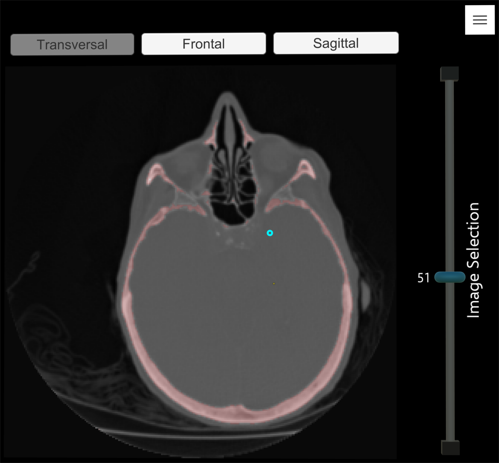
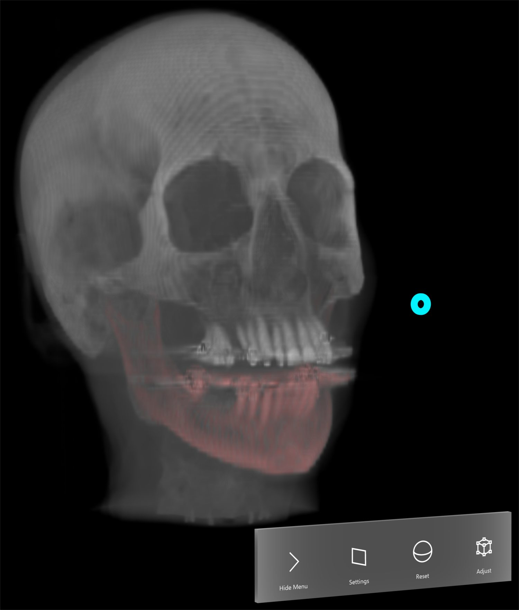

# DICOM HoloViewer

The DICOM HoloViewer is an Unity Application capable of loading and displaying the 3D data inside of DICOM files using the Microsoft HoloLens.
## Getting Started

These instructions will get you a copy of the project up and running on your local machine for development and testing purposes. See deployment for notes on how to deploy the project onto a HoloLens.

### Prerequisites

This project hast only been tested on Windows 10. Other operating systems might have trouble connecting to the HoloLens, running the Emulator or building for the Universal Windows Platform (UWP)

### Installing

Install Unity 2018.3.0f2 (Might work with newer versions of Unity, depending on the introduced changes). When prompted make sure the following components are selected:

* UWP Build Support (IL2CPP)
* Windows Build Support (IL2CPP)

You can either select Visual Studio from the Unity installer or install it manually afterwards.

Clone this repository into the desired folder and open it inside of Unity.

    git clone https://github.com/mrcdnk/dicomholo.git

Now You are ready to run it from inside the editor.

To build the application or stream it via holographic remoting you need to setup the project as follows:

1. Go to the "File" dropdown menu at the top and select "Build Settings".
2. Select "Universal Windows Platform".
3. Set the target device to HoloLens and confirm with the "Switch Platform" Button.
4. Set the architecture to x86 and the minimum platform version to at least 10.0.17134.0.
5. Press "Build" to create the Visual Studio solution for deploying the application.
6. Open the generated solution in Visual Studio 2017, if you haven't installed the necessary windows development tools, VS will prompt you to install them now. It may be necessary to repeat this step to install all needed Visual Studio extensions.

You can now deploy the application onto the HoloLens via USB or the Emulator ([Installation Guide](https://docs.microsoft.com/en-us/windows/mixed-reality/using-the-hololens-emulator))

### Adding a DICOM Dataset

DICOM datasets have to be put into a folder inside the "Assets/StreamingAssets" folder of the project. It may be necessary to simplify the name if it contains a lot of (special) characters.

While executing the application inside the Unity editor the name of the DICOM files doesn't matter, but when running it on the HoloLens the only valid file name formats are:

* CTHd*nnn*, where *nnn* is the image index (e.g. CTHd000, CTHd001, ..., CTHd112)
* CTHd*nnn*.dcm
* *nnnnnn*, where *nnnnnn* is the image index (e.g. 000000, 000001, ..., 000112)
* *nnnnnn*.dcm
### Holographic Remoting

The Holographic Remoting Window inside the "Window/XR" Dropdown enables you to simulate the interaction with a HoloLens using a controller inside the editor or stream the application run inside of the editor to the device.

## Deployment

1. In the Unity editor select "Build" in the "Build Settings" dialog.
2. Open the generated solution in Visual Studio 2017.
3. Select the device or emulator as build target and start the building the application.

## Example Images

| 2D Slice View      | 3D Volume Rendering      |
|------------|-------------|
| {:width="50%"} | {:width="50%"} | 
## Troubleshooting

If you get the Error: 
>DEP6100 : The following unexpected error occurred during bootstrapping stage [...]

Try the solution from this [forum post](https://forums.hololens.com/discussion/238/dep6100-the-following-unexpected-error-occurred-during-bootstrapping-stage):

1. Run cmd as admin and enter the following commands set devmgr_show_nonpresent_devices=1 start devmgmt.msc
2. This will startup the device manager and show the list of hyper v network adapters
3. Right click and uninstall all hyper v network adapters
4. Open Hyper v manager and delete the virtual machines
5. From Virtual Switch Manager (right side of hyper-v manager), delete all internal switches
6. Restart the system and run visual studio and launch emulator

## Built With

* [Unity](http://www.dropwizard.io/1.0.2/docs/) - implemented in Unity 2018.3.0f2 using Visual Studio 2017
* [HoloToolkit](https://github.com/Microsoft/MixedRealityToolkit-Unity/tree/htk_release) - Used for general HoloLens specific functionality and is now maintained as MixedRealityToolkit
* [SliderWidget](https://github.com/vinothpandian/Hololens-SliderWidget) - Provides the base model for the slider, source code hast mostly been rewritten
* [VolumetricRendering](https://github.com/mattatz/unity-volume-rendering) - Main object space volumetric rendering Shader used
* [RayCasting](https://github.com/brianasu/unity-ray-marching) - Alternative screen space ray casting shader 

## Author

**Marco Deneke** - *Master Thesis in Computer Science* - [mrcdnk](https://github.com/mrcdnk)

## License

This project is licensed under the MIT License - see the [LICENSE.md](LICENSE.md) file for details

## Acknowledgments

* Thanks to Karl-Ingo Friese for providing the java source code of the DICOM parser used in his dissertation [YaDiV](https://www.researchgate.net/publication/220067486_YaDiV-an_open_platform_for_3D_visualization_and_3D_segmentation_of_medical_data).
